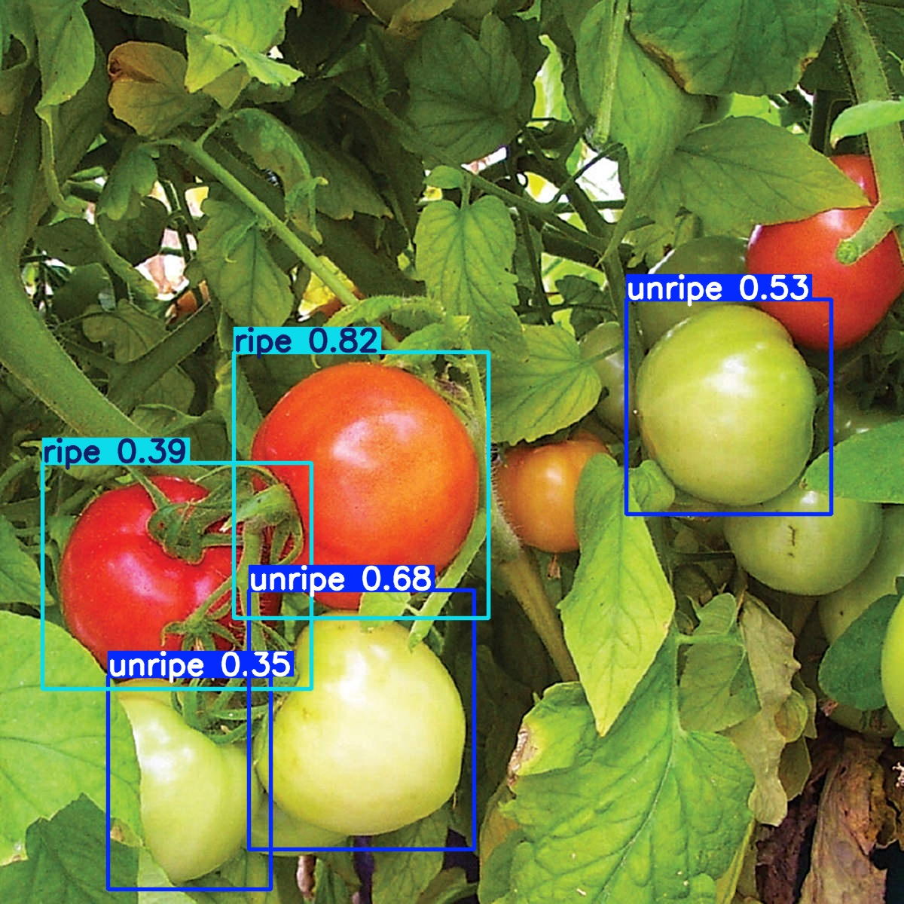
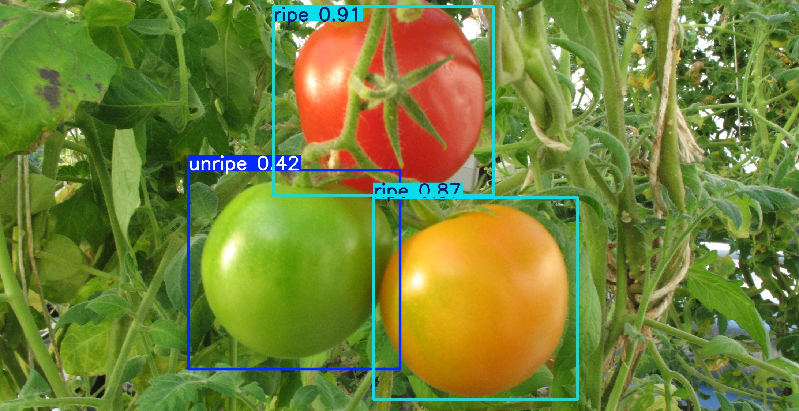
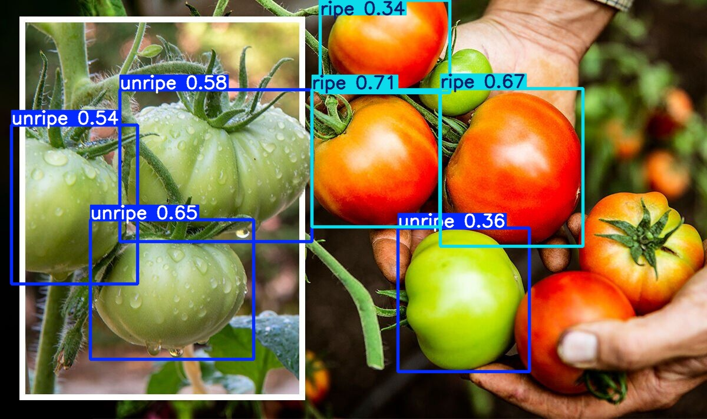

# Tomato Prediction
* Predicted tomato ripeness (ripe or unripe) using YOLOv8.
* Trained the model from the following [Kaggle Dataset](https://www.kaggle.com/datasets/sumn2u/riped-and-unriped-tomato-dataset)

## Results

